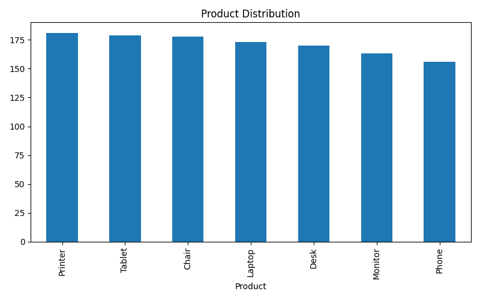
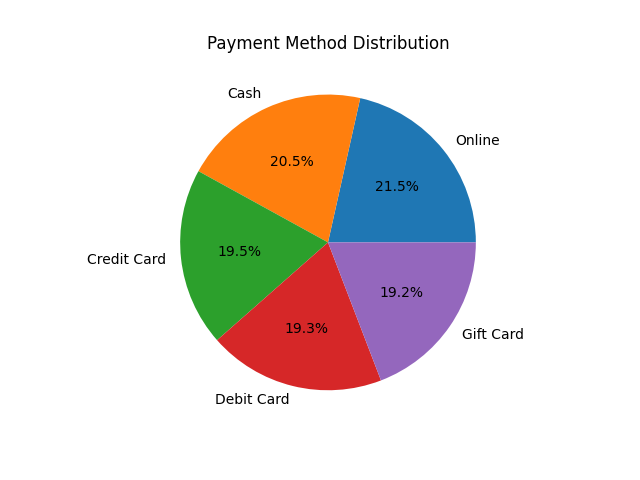
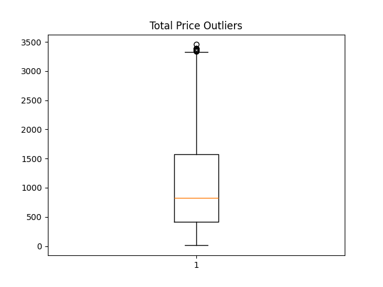
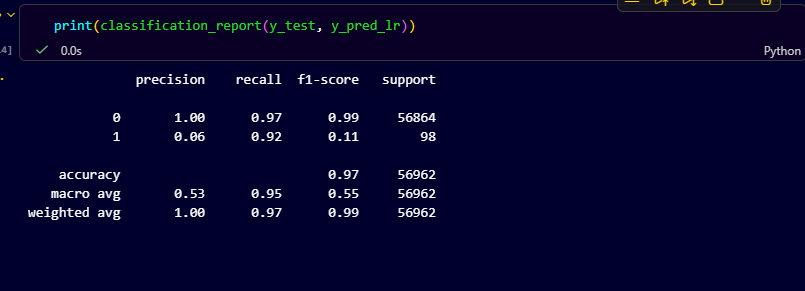
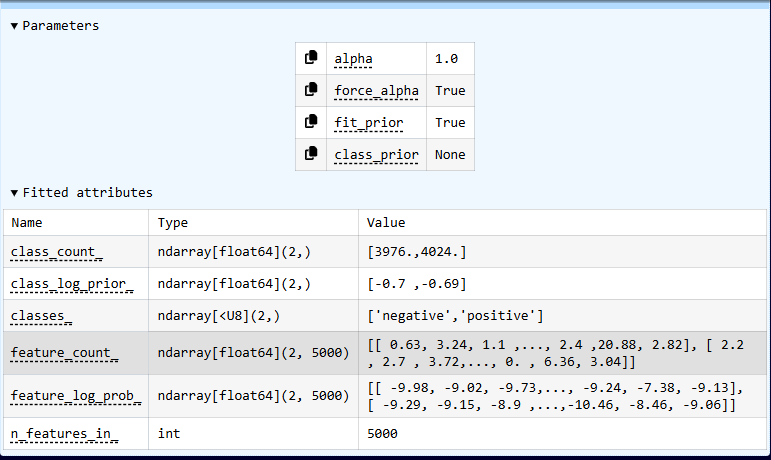

# 🚀 DecodeLabs Internship - Data Science Projects

Welcome to my Data Science Internship Projects repository. This repository contains four end-to-end projects completed during the DecodeLabs Industrial Training Program.

## 👨‍💻 Author
**Shivrajsinh Rajput**

---

# 📊 Project 1: Advanced EDA & Feature Engineering

### Skills Used
- Data Cleaning
- Exploratory Data Analysis
- Feature Engineering
- Outlier Detection

📁 Folder:
[Project1_Advanced-EDA-Feature-Engineering](./Project1_Advanced-EDA-Feature-Engineering)

### Visualizations

#### Product Distribution

#### Payment Method Distribution

#### Outlier Detection

---

# 💳 Project 2: Fraud Detection Pipeline

### Skills Used
- SMOTE
- Random Forest
- Classification Metrics
- Confusion Matrix

📁 Folder:
[Project2_Fraud_Detection_Pipelin](./Project2_Fraud_Detection_Pipelin)

### Visualizations

#### Fraud vs Non-Fraud

#### Confusion Matrix

#### Evaluation Metrics

---

# 👥 Project 3: Customer Segmentation using PCA & K-Means

### Skills Used
- PCA
- K-Means Clustering
- Elbow Method
- Silhouette Score

📁 Folder:
[Project3_Customer-Segmentation](./Project3_Customer-Segmentation)

### Visualizations

#### Elbow Method

#### Silhouette Score

#### Customer Segmentation

---

# 📝 Project 4: NLP & Sentiment Analysis

### Skills Used
- Text Preprocessing
- TF-IDF
- Naive Bayes
- Sentiment Classification

📁 Folder:
[Project4_NLP-Sentiment-Analysis](./Project4_NLP-Sentiment-Analysis)

### Results

- Accuracy: **85.35%**

#### Model Performance

#### Confusion Matrix

---

# 🛠 Technologies Used

- Python
- Pandas
- NumPy
- Matplotlib
- Seaborn
- Scikit-Learn
- NLTK

---

# ⭐ Repository Highlights

✅ Exploratory Data Analysis

✅ Feature Engineering

✅ Fraud Detection using Machine Learning

✅ Customer Segmentation using PCA and K-Means

✅ Natural Language Processing (NLP)

✅ Sentiment Analysis using TF-IDF and Naive Bayes

---

# 📌 GitHub Repository

🔗 https://github.com/ShivrajRajput99/Decodelabs-Internship-Data-Science

---
⭐ If you found this repository useful, please give it a star!
